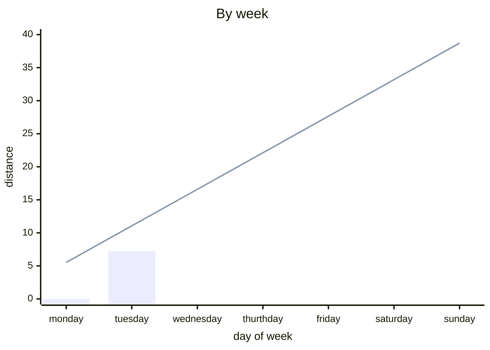
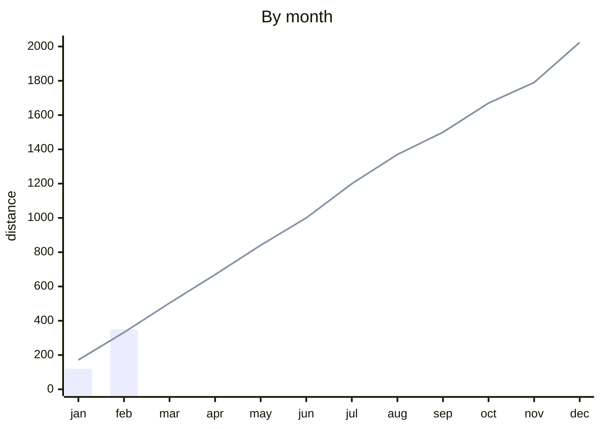

# My German notes

[GitHub page](https://d45a74.github.io/deutsch/)

## Markdown as website

[Mkdocs](https://squidfunk.github.io/mkdocs-material/publishing-your-site/)

- [admonitions](https://squidfunk.github.io/mkdocs-material/reference/admonitions/#supported-types)
- [formatting](https://squidfunk.github.io/mkdocs-material/reference/formatting/#usage)

``` bash
 docker volume create --name mkdocs -d local -o type=none -o o=bind -o device="$PWD"
 docker run --rm -it -p 8000:8000 -v mkdocs:/docs squidfunk/mkdocs-material
```

## By week



## By month


