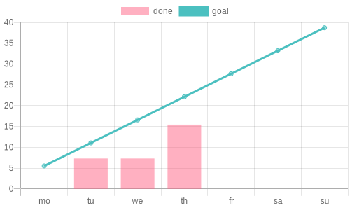
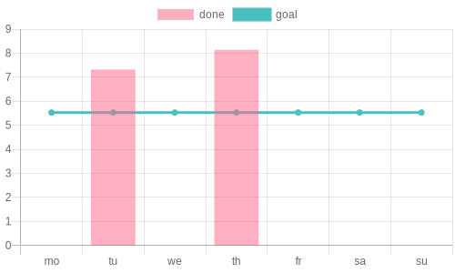
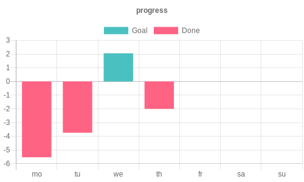

# Mein German

[Online version](https://d45a74.github.io/deutsch/)

!!! warning ""

    Не забувай в думках ні на хвилину,  
    Щоб ти вночі собі солодко спав,  
    Хтось вдома залишив свою дитину,  
    А хтось і взагалі життя віддав

## By week








```bash
curl --location 'https://quickchart.io/chart' \
--header 'Content-Type: application/json' \
--data '{
    "version": "2",
    "backgroundColor": "transparent",
    "width": 500,
    "height": 300,
    "devicePixelRatio": 1.0,
    "format": "png",
    "chart": {
        "type": "bar",
        "data": {
            "labels": [
                "monday",
                "tuesday",
                "wednesday",
                "thurthday",
                "friday",
                "saturday",
                "sunday"
            ],
            "datasets": [
                {
                    "label": "goal",
                    "data": [
                        5.53,
                        11.06,
                        16.59,
                        22.12,
                        27.65,
                        33.18,
                        38.71
                    ]
                },
                {
                    "label": "real",
                    "data": [
                        0,
                        7.23,
                        7.23
                    ]
                }
            ]
        }
    }
}'
```
