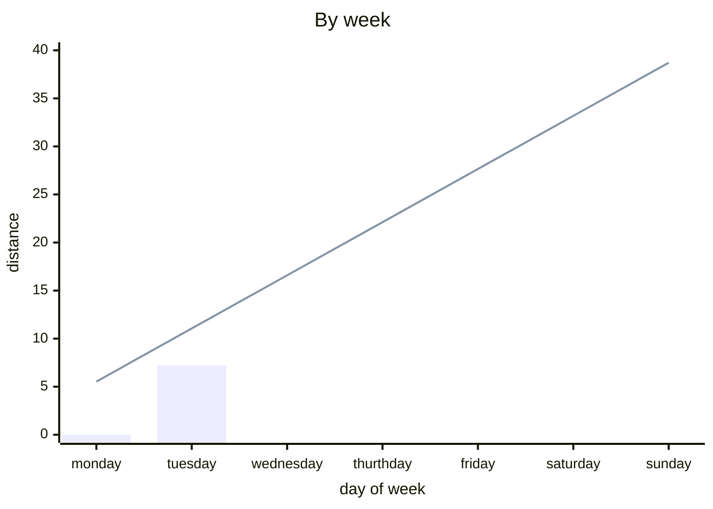
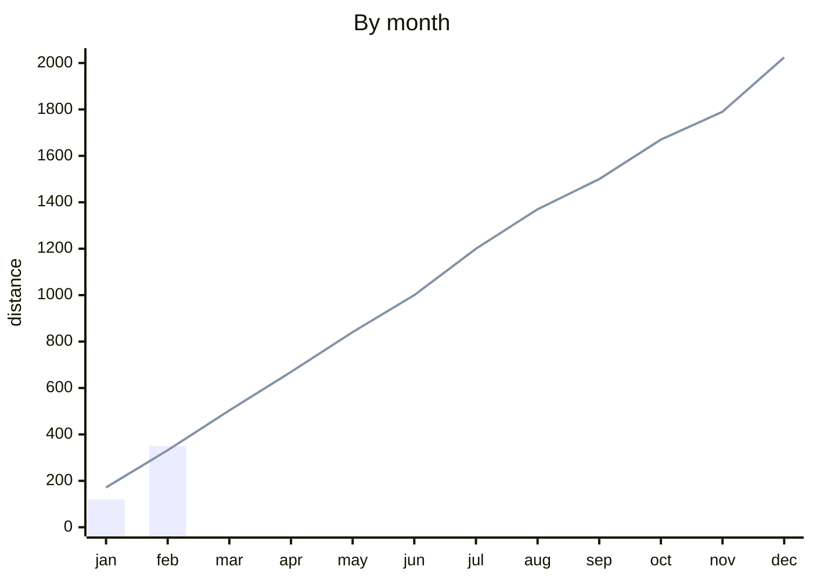

# Mein German

[Online version](https://d45a74.github.io/deutsch/)

!!! warning ""

    Не забувай в думках ні на хвилину,  
    Щоб ти вночі собі солодко спав,  
    Хтось вдома залишив свою дитину,  
    А хтось і взагалі життя віддав

# Walking

## By week

## By month

